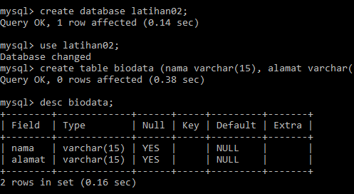
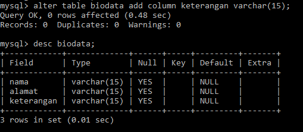
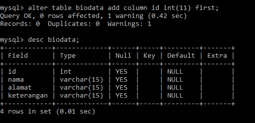

# data mahasiswa
<<<<<<< HEAD
 # 1. Buat sebuah database dengan nama latihan2!
mysql> use latihan02;
=======
# 2. Buat sebuah tabel dengan nama biodata (nama, alamat) didalam database latihan1!

mysql>create table biodata (nama varchar (15), alamat varchar (15));

3. # Tambahkan sebuah kolom keterangan (varchar 15), sebagai kolom terakhir!
mysql> alter table biodata add column keterangan varchar (15);
mysql> desc biodata

# 4. Tambahkan kolom id (int 11) di awal (sebagai kolom pertama)!
 mysql> alter table biodata add column id int(11) first;
 

=======

>>>>>>> 026813af7fa049f74b5ee14a7526eaf48edf779c

